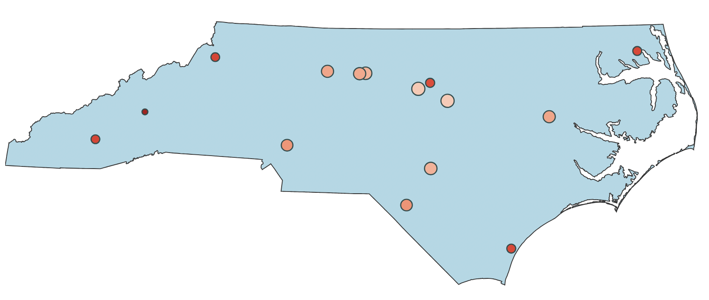
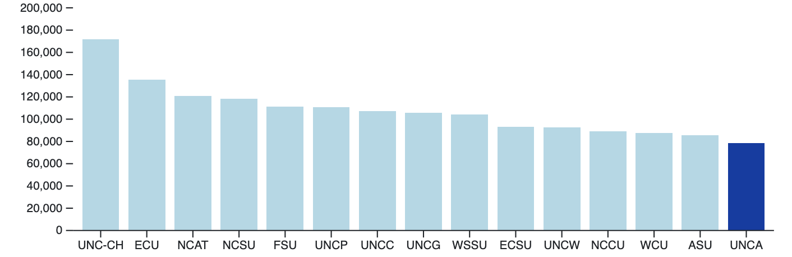
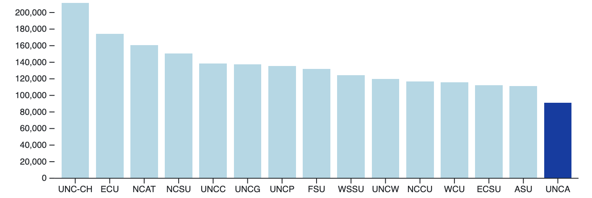
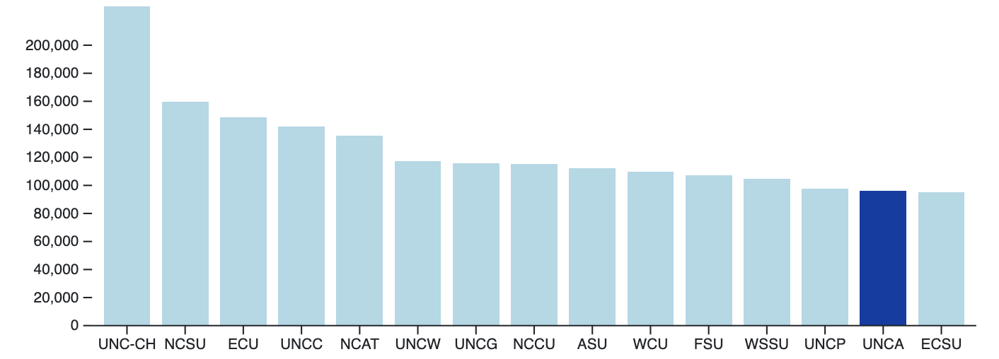
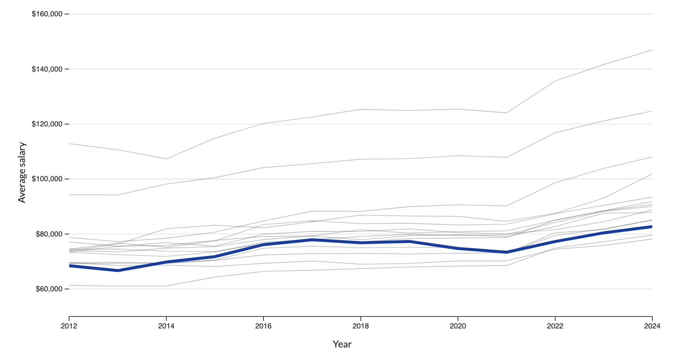
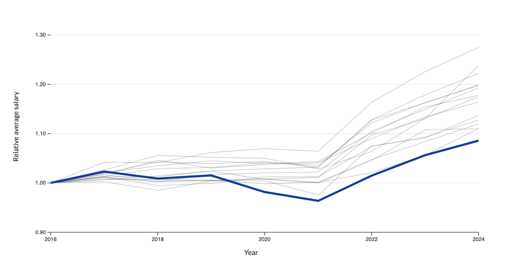
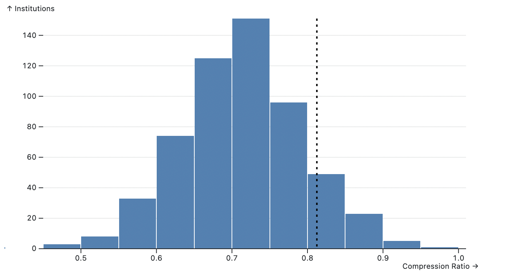
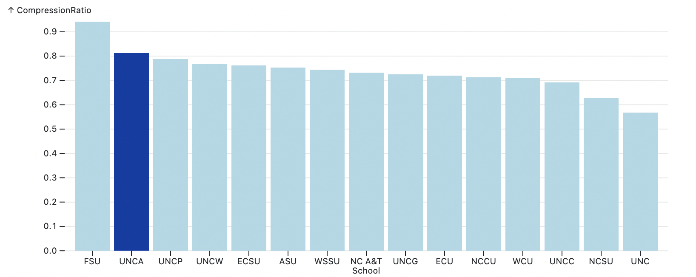
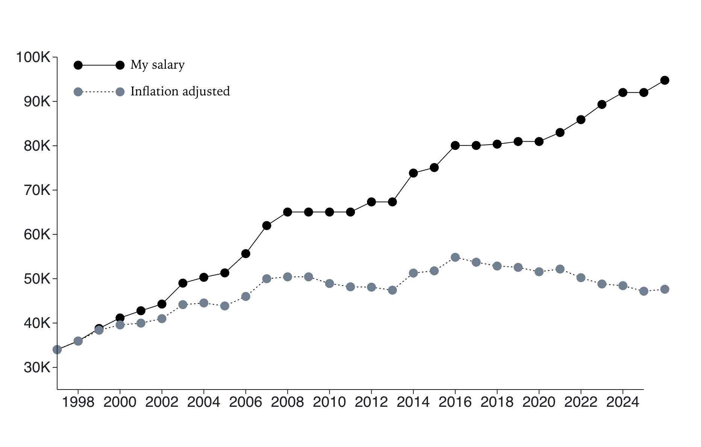
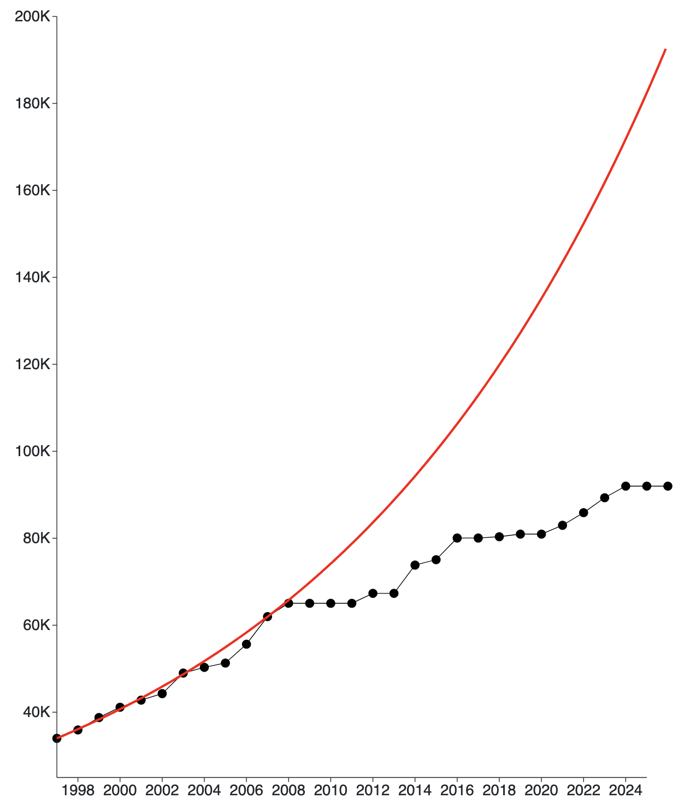

 


::: {#fig-unc_salary_map fig-cap="UNC System Schools: Size and shade scaled by faculty salary adjusted by cost of living."}

::::: {.content-visible when-format="html"}

```{ojs}
import {make_map} from "./components/unc_salary_map.js";

unc_salary_map_topo = await FileAttachment("./data/nc.json").json()
unc_salary_map_cohort = await FileAttachment("./data/projected_cohorts2@1.csv")
  .csv({typed: true})

make_map(unc_salary_map_topo, unc_salary_map_cohort)
```

:::::

::::: {.content-visible when-format="pdf"}



:::::

:::

## Intro

It's no secret that UNCA has long been underfunded. At least eight different groups have issued reports studying this issue since 2017/2018.
 
[Here are [links to these past reports](./PointersToPastReports.html).]{.content-visible when-format="html"}
[References to those past reports appear as [an addendum](#sec-past-reports-addendum) to this document.]{.content-visible when-format="pdf"}

The primary objective of this document is to summarize the status of faculty pay at UNCA relative to other institutions within the UNC System, as well as to other schools with a focus on the liberal arts and sciences - both public and private. In addition, I provide a rather personal perspective as someone in my 30th year at UNCA.

## UNCA within the UNC System

Let's begin by taking a look at how UNCA compares to other schools in the UNC system - both currently and historically.

### Salaries across the UNC System

@fig-system_salary_bar_chart shows how salaries in the system look now. 
The data comes from the UNC System Salary database and is current as of October 1st, 2026. 

The charts show average salaries for various groups of non-medical faculty across the UNC System. UNCA fares well in none of these charts.

:::::: {.content-visible when-format="html"}
::::: {.cr-section .system-salary-scrolly layout="overlay-center"}

UNCA faculty salaries rank dead last in the system when adjusted for cost of living.
@cr-system_salary_chart

The situation is particularly bleak for full professors whose adjusted salary is nearly 20% below that of the next highest system school.
@cr-system_salary_chart

Even when considering raw salaries not adjusted for inflation, UNCA's full professors rank one step from the bottom.
@cr-system_salary_chart

You can use the controls to explore how other groups compare, with and without cost of living adjustment.
@cr-system_salary_chart

<div focus-on="cr-system_salary_chart" style="opacity:0"></div>

:::: {#cr-system_salary_chart .show-on-load}

::: {#fig-system_salary_bar_chart fig-cap="Salary bar chart"} 

```{ojs}
viewof group = Inputs.radio(
  ["All", "Professor", "Associate", "Assistant", "Lecturer"],
  {label: "Faculty group:", value: "All"}
)
viewof col_adjust = Inputs.toggle({label: "CoL Adjust:", value: true})
```

```{ojs}
import {
  summarize_data,
  make_salary_viz,
  salary_scrolly_state,
  salary_scrolly_params,
  sync_salary_controls
} from './components/system_salary_viz.js';
small_summary_salaries = await (await FileAttachment("./data/small_summary_data.csv")
    .csv({typed: true}));
system_salary_chart = make_salary_viz(summarize_data(data, "All", "Avg Salary", true)); 
```

```{ojs}
system_salary_state = salary_scrolly_state(crTriggerIndex)
system_salary_controls = sync_salary_controls(system_salary_state, {
  group: viewof group,
  col_adjust: viewof col_adjust
})
system_salary_params = salary_scrolly_params(system_salary_state, {
  group,
  sort_by: "Avg Salary",
  col_adjust
})
summary_data = summarize_data(
  data,
  system_salary_params.group,
  system_salary_params.sort_by,
  system_salary_params.col_adjust
)
system_salary_update = system_salary_chart.update(summary_data)
```

:::
::::
::::: 
::::::

::::: {.content-visible when-format="pdf"}
::: {#fig-system_salary_bar_chart fig-cap="Salary bar chart" layout-ncol=1}





:::

::::: 


### The evolution of system salaries

@fig-system_salary_timeseries shows how salaries have evolved from 2012 or 2016 until 2024. This is based on IPEDS data, which provides data over many years but is not as current as the system data. [You can hover over the chart to see who's who.]{.content-visible when-format="html"}

::: {.content-visible when-format="pdf"}

In the first chart, we see that UNCA salaries have been near the bottom of all the system schools since 2012. In the second, we see that the growth rate of UNCA's salaries has been the worst in the system over the time span starting in 2016.

:::


:::::: {.content-visible when-format="html"}
::::: {.cr-section .system-salary-scrolly layout="overlay-center"}

Here's a look at how overall salaries have evolved across the system since 2012. It's not too surprising to see UNCA near the bottom.
@cr-system_salary_timeseries_chart

We can normalize the salaries to the first year to view relative changes, rather than absolute. We can now see that part of UNCA's continuing challenge is the slower growth of salaries relative to its already small salaries.
@cr-system_salary_timeseries_chart

Things seem to be particularly dismal for UNCA since 2016/2017.
@cr-system_salary_timeseries_chart

You can use the controls to choose a group, start year, and whether to normalize.
@cr-system_salary_timeseries_chart

<div focus-on="cr-system_salary_timeseries_chart" style="opacity:0"></div>

:::: {#cr-system_salary_timeseries_chart .show-on-load}

::: {#fig-system_salary_timeseries fig-cap="Average salaries across the UNC System over time"}

```{ojs}
ipeds_system_salaries_timeseries = await FileAttachment("./data/ipeds_system_salaries_timeseries.csv")
  .csv({typed: true})

viewof salary_timeseries_group = Inputs.radio(
  ["All", "Prof", "Assoc", "Assist", "Non TT"],
  {label: "Faculty group:", value: "All"}
)
viewof salary_timeseries_start_year = Inputs.radio(
  ["2012", "2016"],
  {label: "Start year:", value: "2012"}
)
viewof salary_timeseries_normalize = Inputs.toggle({label: "Normalize:", value: false})
```

```{ojs}
import {
  prepare_salary_timeseries,
  make_salary_timeseries_viz,
  local_closeread_trigger_index,
  salary_timeseries_scrolly_state,
  salary_timeseries_scrolly_params,
  sync_salary_timeseries_controls
} from "./components/system_salary_viz.js";

salary_timeseries_chart = make_salary_timeseries_viz(
  prepare_salary_timeseries(
    ipeds_system_salaries_timeseries,
    "All",
    false,
    2012
  ),
  {normalize: false}
)
```

```{ojs}
salary_timeseries_state = salary_timeseries_scrolly_state(
  local_closeread_trigger_index(crTriggerIndex, "cr-system_salary_timeseries_chart")
)
salary_timeseries_controls = sync_salary_timeseries_controls(salary_timeseries_state, {
  group: viewof salary_timeseries_group,
  start_year: viewof salary_timeseries_start_year,
  normalize: viewof salary_timeseries_normalize
})
salary_timeseries_params = salary_timeseries_scrolly_params(salary_timeseries_state, {
  group: salary_timeseries_group,
  start_year: salary_timeseries_start_year,
  normalize: salary_timeseries_normalize
})
salary_timeseries_update = salary_timeseries_chart.update(
  prepare_salary_timeseries(
    ipeds_system_salaries_timeseries,
    salary_timeseries_params.group === "Non TT" ? "nontt" : salary_timeseries_params.group,
    salary_timeseries_params.normalize,
    salary_timeseries_params.start_year
  ),
  {normalize: salary_timeseries_params.normalize}
)
```

:::
::::
:::::

::::::

::::: {.content-visible when-format="pdf"}
::: {#fig-system_salary_timeseries fig-cap="System salary time series" layout-ncol=1}




:::

::::: 

\newpage 

## Salary compression

Salary compression is the presence of relatively small differences in pay between groups with significantly different levels of experience or rank. It's a natural equity issue leading to problems with morale and retention, as well as promoting "quiet quitting".

One way to measure salary compression at an institution of higher learning is to compute the ratio of the average assistant professor salary divided by the average full professor salary. The larger that number, the more salary compression we have. The value of a healthy ratio might not be immediately clear but we can at least compare that ratio across a number of institutions. Let's call this number the *compression ratio*.

There are 570 public, four-year institutions where IPEDS provides sufficient data to compute the compression ratio. The average value of those compression ratios is 0.71214 with a standard deviation of 0.083474. UNCA's compression ratio is 0.812445, which puts us 1.20163 standard deviations past the mean. Not ideal.

Here's a histogram of all the compression ratios with a dashed line for UNCA:

::: {#fig-national_salary_compression fig-cap="Salary compression at public, four-year institutions"} 
::::: {.content-visible when-format="html"}

```{ojs}
compression_ratios = await FileAttachment("./data/compression_ratios.csv")
  .csv({typed: true})

unca_compression_ratio = {
  const unca = compression_ratios.find(o => o.UnitID === 199111);
  if (!unca) throw new Error("Could not find UNCA in compression_ratios.csv");
  return unca.CompressionRatio;
}

Plot.plot({
  height: 360,
  marginLeft: 52,
  y: {
    grid: true,
    label: "Institutions"
  },
  x: {
    domain: [0.45, 1.01],
    label: "Compression Ratio"
  },
  marks: [
    Plot.rectY(
      compression_ratios,
      Plot.binX(
        {y: "count"},
        {x: "CompressionRatio", fill: "steelblue"}
      )
    ),
    Plot.ruleY([0]),
    Plot.ruleX([unca_compression_ratio], {
      stroke: "black",
      strokeWidth: 2,
      strokeDasharray: "3,5"
    })
  ]
})
```
:::::
::::: {.content-visible when-format="pdf"}

:::::
:::

We can also check where UNCA's compression ratio lies in the UNC System. UNCA has the second highest compression ratio in the UNC System; only Fayetteville State has a higher compression ratio. Chapel Hill has the lowest compression ratio, followed by NC State.

::: {#fig-system_salary_compression fig-cap="Salary compression in the UNC System"} 
::::: {.content-visible when-format="html"}

```{ojs}
nc_compression_ratios = await FileAttachment("./data/NCCompression.csv")
  .csv({typed: true});
Plot.plot({
    color: { type: "identity" },
    x: {
      domain: d3.sort(nc_compression_ratios, (d) => -d.CompressionRatio).map((d) => d.UnitID),
      tickFormat: (d) => {
        const abbr = nc_compression_ratios.filter(o => o.UnitID == parseInt(d))[0].abbr;
        return abbr
      },
        label: "School"
    },
    y: {
      grid: true
    },
    width: width,
    height: 0.4 * width,
    marginLeft: 70,
    marks: [
      Plot.barY(nc_compression_ratios, {
        x: "UnitID",
        y: "CompressionRatio",
        fill: (d) => (d.UnitID == 199111 ? "#003DA5" : "lightblue"),
      })
    ]
  });
```

:::::
::::: {.content-visible when-format="pdf" fig-pos="H"}

:::::
:::


## My salary

Let's take a look at my own salary history - in part, because this is a personal matter for me and, also, because I happen to have access to my own complete salary history but no one else's. Presumably, there's a similar story for most long tenured faculty; hopefully, this is not what younger faculty can expect, if they stay at UNCA for a long time.

### My salary history and inflation

@fig-my_salary is based on my own personal data and then shows the same history after adjustment for inflation.


:::::: {.content-visible when-format="html"}
::::: {.cr-section .system-salary-scrolly layout="overlay-center"}

Here's my salary history in raw dollars.
@cr-my_salary_chart

Here's the same salary history after adjusting for inflation.
@cr-my_salary_chart

<div focus-on="cr-my_salary_chart" style="opacity:0; height:0px;"></div>

:::: {#cr-my_salary_chart .show-on-load}

::: {#fig-my_salary fig-cap="My salary history"} 

```{ojs}
import {
  prepare_my_salaries, 
  make_my_salary_viz, 
  make_my_expected_salary_viz
} from './components/my_salary_viz.js';
import {local_closeread_trigger_index as my_salary_closeread_trigger_index} from "./components/system_salary_viz.js";
```

```{ojs}
my_salary_data = {
  const salaries = await FileAttachment("./data/my_salaries.csv").csv({typed: true});
  const inflation_multipliers = await FileAttachment("./data/inflation_multipliers.csv")
    .csv({typed: true});
  return prepare_my_salaries(salaries, inflation_multipliers);
}

my_salary_chart = make_my_salary_viz(my_salary_data)
``` 

```{ojs}
my_salary_inflation = my_salary_closeread_trigger_index(crTriggerIndex, "cr-my_salary_chart") >= 1
my_salary_update = my_salary_chart.update(my_salary_inflation)
```

:::
::::
:::::
::::::

::::: {#fig-my_salary .content-visible when-format="pdf"}

:::::

The chart also shows my salary after adjustment for inflation; that situation is clearly worse. I have, in fact, less purchasing power now than I had 19 years ago in 2007.


### What might I expect?

I started in academic year 1997/1998 with a salary of $34,000 a year. My salary has generally gone up, though, sometimes faster than others. During my first decade at UNCA, my salary increased from $34,000 to $61,992, which is an effective annual rate of 6.19%.

Assuming I had consistent annual increases of 6.19% since I started at UNCA, my salary now would be
$$\$34,000 \times (1.0619)^{29} = \$194,046.$$ 
Instead, my salary is $94,767 - well under half of what I might've expected to make after my first decade.

@fig-my_expected_salary shows how I might've expected my salary to grow at 6.19% compared to reality.

::: {#fig-my_expected_salary fig-cap="My expected salary based on my first decade"} 
::::: {.content-visible when-format="html"}

```{ojs}
make_my_expected_salary_viz(my_salary_data)
```
:::::

::::: {.content-visible when-format="pdf"}

:::::
:::

It's worth pointing out that I have *very* advanced technical skills with software development experience in industry and expertise in machine learning dating back well before the current AI craze. I have exactly the skills our school supposedly seeks for its so-called "future forward curriculum". Why that's not recognized in my compensation, I don't know.

### One more data point

Here's one more data point I learned during a recent academic program review:

::: {.callout-note appearance="minimal"}

The average annual salary of UNCA mathematics graduates is $103,000. No one in our department makes even $100,000.

:::

## The role of enrollment

There's a near constant drumbeat from our administration that we've got to increase enrollment. If we can just get our enrollment up to a sustainable 3,200 students, then money will flow in and salaries will increase. At least, that's the description at [UNCA's 2030 plan page](https://www.unca.edu/asheville-2030/){target=_blank}.

::: {.callout-note appearance="minimal"}

I don't buy it.

:::

### The real issue

According to the most recent IPEDS data, UNCA had almost identical enrollments in 2024 and 1996. The difference is that, in the 1990s, small was good. In fact, UNCA was quite selective at that time; within the system, only UNC Chapel Hill was more selective and not by much.

The idea that "small was good" changed concretely around 2011/2012. Prior to that time, UNCA's funding was protected by a specific "hold harmless" policy that protected state funding from reduction as a result enrollment issues. Six campuses received this type of protection but only UNCA received this protection as a result of its "special mission". This was made explicit on [page 36 of the UNC System's Long-Range plan](https://www3.unca.edu/facultysenate/y0506/Long-Range_Plan_2004-2009.pdf#page=47){target=_blank} which specifies that the system should

> **Restrain enrollment growth** at UNC Asheville and the North Carolina School of the Arts in recognition of their special missions.

According to [this NCLeg document](https://sites.ncleg.gov/ped/2010-05/){target=_blank}, the hold harmless policy was rescinded in Jan 2011. Continuing policy changes have further weakened our funding model at least three more times. These funding changes are the real cause of our financial challenges.


### How large do we need to be?

Given the current funding model, it's reasonable to ask - just how large does UNCA need to grow?

I don't know the answer to that question but I do know that when then VC for Financial Affairs John Pierce reported in 2022 as part of the Cable administration's *Revitalization Plan*, he found that


- UNCA had an annual $24,000,000 funding gap when compared to average peer institutions and that
- An annual enrollment of 4000 students would close that gap by only about $5,000,000.

In a private conversation, he further indicated to me that an enrollment of 5000 students would still get us nowhere close to where we needed to be. He was equally clear that the fundamental issue is inadequate funding from the State.

### Summary

I like students and would be perfectly happy to have more. I participate every year in some sort of recruitment activity and do my best to meet students where they are to improve retention. I think it would be great if we got up to 3200 students or even a bit more. But...

::: {.callout-note appearance="minimal"}

Enrollment has nothing to do with our financial challenges as an institution.
It's a simple matter of funding levels from the State.

:::

There's a lot of excellence spread throughout our hardworking, dedicated faculty. It would be nice to see this recognized in the form of commensurate pay.

## Data sources

Salary data for the UNC System comes from the [UNC Salary Information Database](https://uncdm.northcarolina.edu/salaries/index.php){target=_blank}. The UNC Database provides microdata on salaries for all employees of the UNC System. It's updated quarterly so it makes for an excellent resource that's detailed and current.

The Cost of Living (CoL) data comes from [Best Places](https://www.bestplaces.net){target=_blank} used here was recorded in October of 2025. Here, for example, is [Best Places CoL page on Asheville](https://www.bestplaces.net/cost_of_living/city/nc/asheville){target=_blank}, which indicates that Asheville has a CoL of 105.8 or about 5.8% higher than the national average.

Average salary data by rank for the 570 public, four-year institutions comes from [IPEDS](https://nces.ed.gov/ipeds){target=_blank}. While not as current, it's really the only publicly available source of data of that breadth.

The inflation data is computed from CPI for Urban areas in the South, which can be obtained from the [Federal Reserve Bank of St Louis](https://fred.stlouisfed.org/series/CUUR0300SA0){target=_blank}.

::::: {.content-visible when-format="html"}

```{ojs}
data = {
  const salaries = await (await FileAttachment("./data/unc_system_condensed_salaries.csv")
    .csv({typed: true}))
    .filter(o => o.job_category != "administrator")
  const CoL = await FileAttachment("./data/UNC_System_CoL.csv").csv({typed: true});
  const groupedCoL = d3.group(CoL, o => o.Abbreviation);
  salaries.forEach(function(o) {
    const d = groupedCoL.get(o.school_abbr)[0];
    o.school_name = d.School;
    o.CoL = d.CoL;
    o.group = o.job_category == "professor" ? "Professor" :
      o.job_category == "associate_professor" ? "Associate" :
      o.job_category == "assistant_professor" ? "Assistant" :
      "Lecturer"
  });
  return salaries
}
```
:::::


\newpage

::: {.content-visible when-format="pdf"}

## Addendum {#sec-past-reports-addendum}



:::
